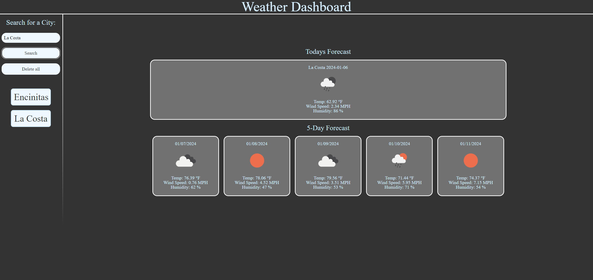

# Weather-Dashboard

## Table of Contents

- [Features](#features)
- [Usage](#usage)
- [Technologies Used](#technologies-used)
- [Contributing](#contributing)
- [Screenshots](#screenshot)
- [License](#license)

## Features

1. **:**
   - 

2. **:**
   - 

## Usage

1. [Website Link](https://charleswt.github.io/Weather-Dashboard/)

2. :
   - 

3. 

## Technologies Used

- HTML
- CSS
- JavaScript
- [Open Weather Map API](https://openweathermap.org/api/)

## Contributing

This project was developed by [Charles Tiffany](https://github.com/charleswt/).

## Screenshot

## License

Please refer to the [LICENSE](https://github.com/charleswt/Weather-Dashboard/blob/main/LICENSE) file in the repository for details.
